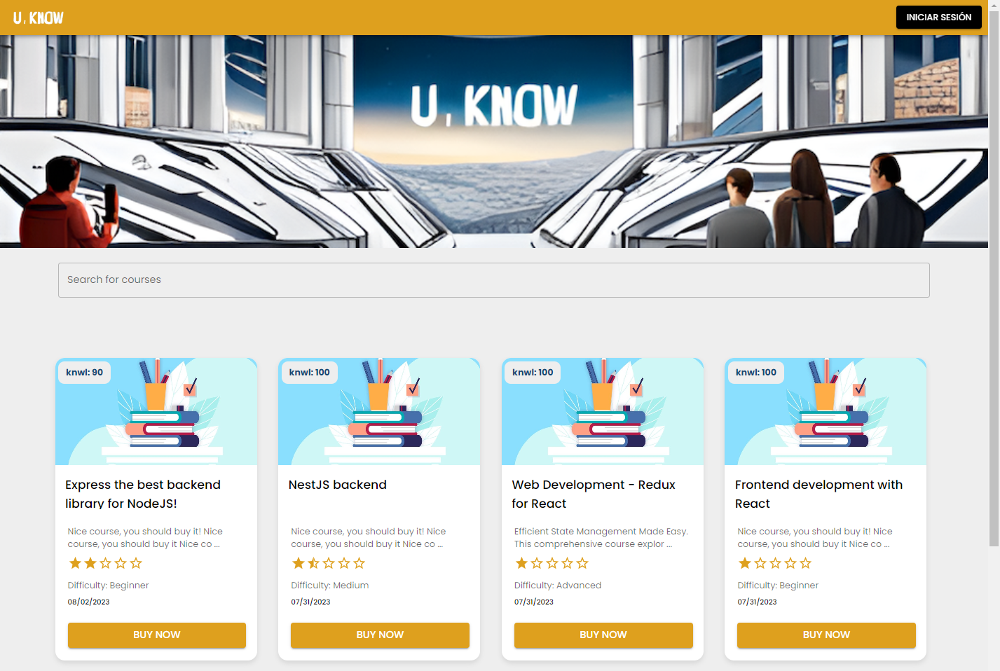
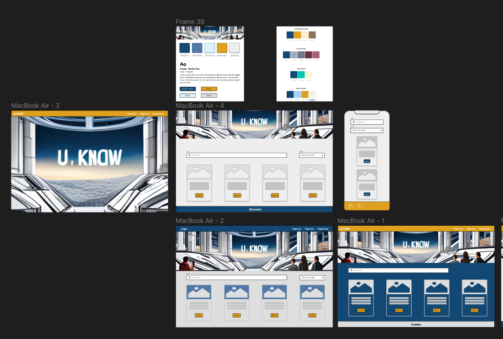

# 📚 U-Know Project
U-Know is the new collaborative learning platform. Our goal is to create a community for learning and sharing knowledge.

The main concept revolves around connecting a backend that consumes a MongoDB database and implementing the frontend using Vite, React, and Material-UI.
This will enable the team to create a highly interactive and user-friendly interface that facilitates seamless knowledge sharing and exchange. The frontend will allow users to browse through available knowledge offerings, initiate exchange requests, and manage their own profiles.

## 🚀 Sprint Goal
The idea of the sprint goal is to implement all the features for both an unauthenticated user and an authenticated user.
The administrative part of the application will be left for future development.

## ✨ User Stories:

- Unregistered user wants to be able to view a list of courses sorted by ratings.
- Unregistered user wants to be able to search and filter courses by keywords.
- Unregistered user wants to be able to view the details, ratings, and comments of a course.
- Unregistered user wants to be able to register on the platform.

- Registered user wants to be able to log in.
- Registered user wants to have the same functionalities as an unregistered user.
- Registered user wants to be able to view and modify their profile.
- Registered user wants to be able to view their purchased content.
- Registered user wants to be able to view and manage their created content.
- Registered user wants to be able to comment on and rate purchased content.
- Registered user wants to be able to purchase courses.
- Registered user wants to be able to create courses.
- Registered user wants to be able to log out.
- Registered user wants to be able to recover their password.

## 🎨 Visual Reference (Figma - prototype)

## 💻 Developers
- Ana | Deniz | Diego | Raúl | Yumi

## 🛠️ Tools and  Technologies

&emsp;

&emsp;

&emsp;
 

  

